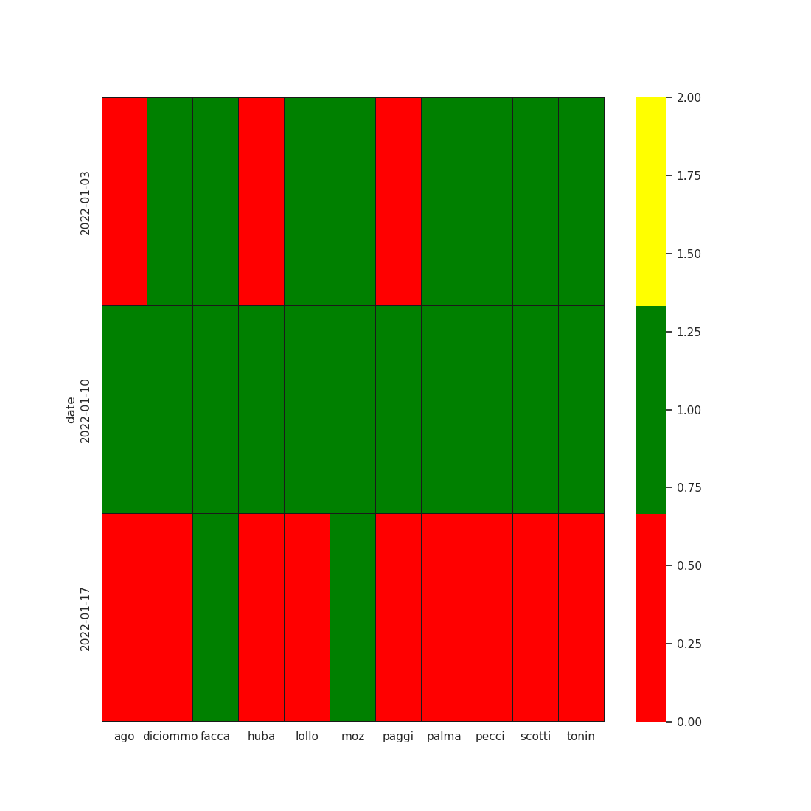
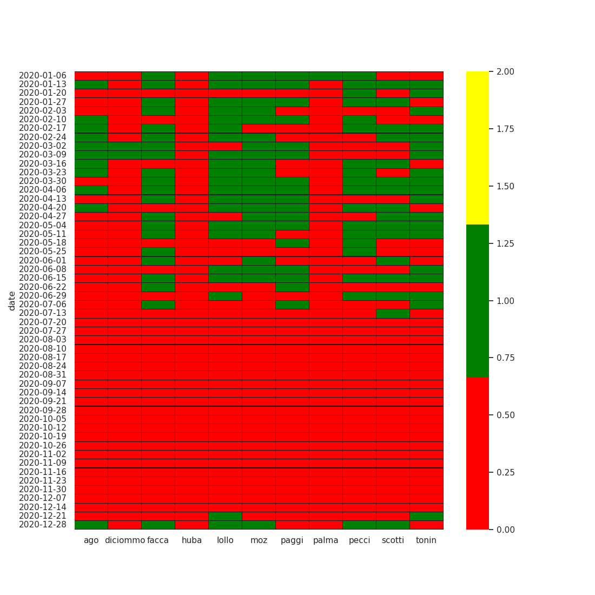
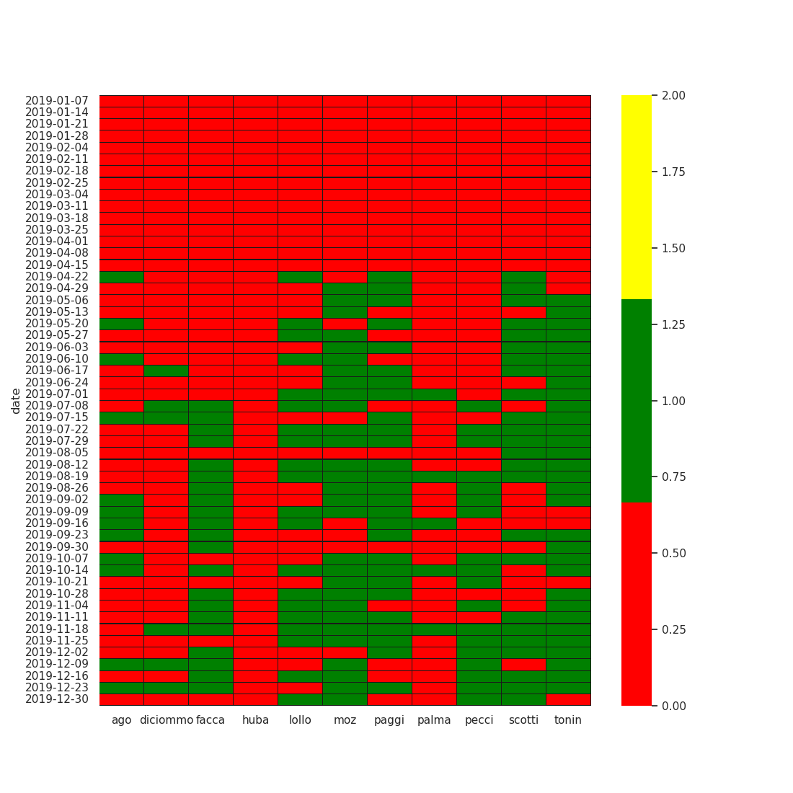
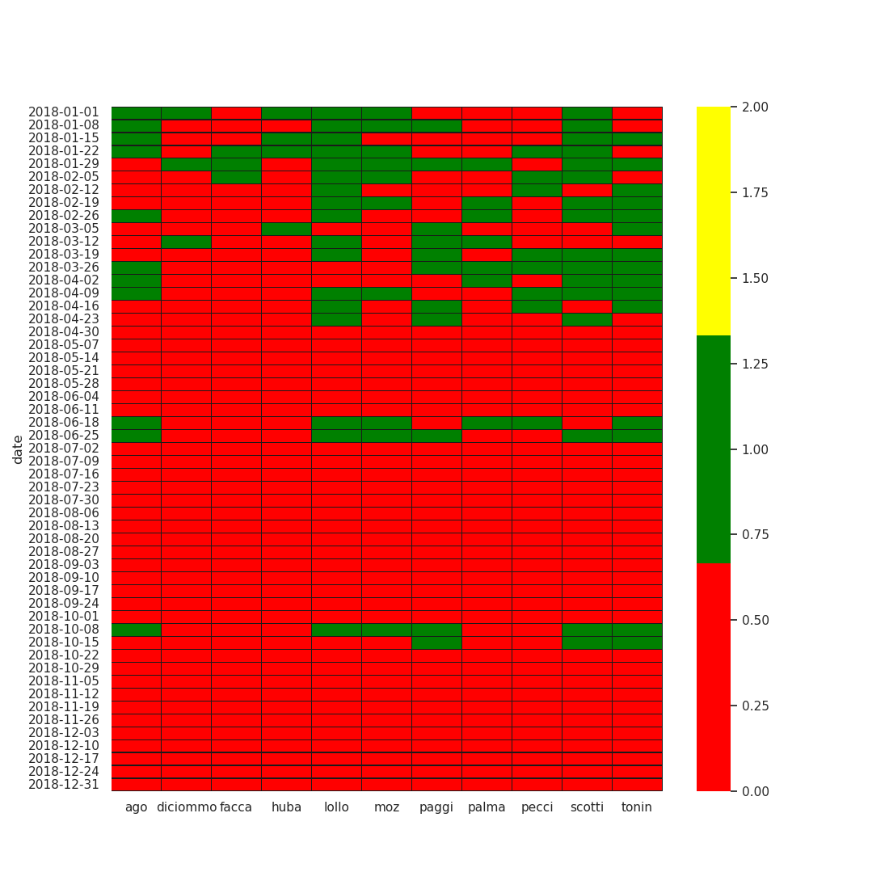
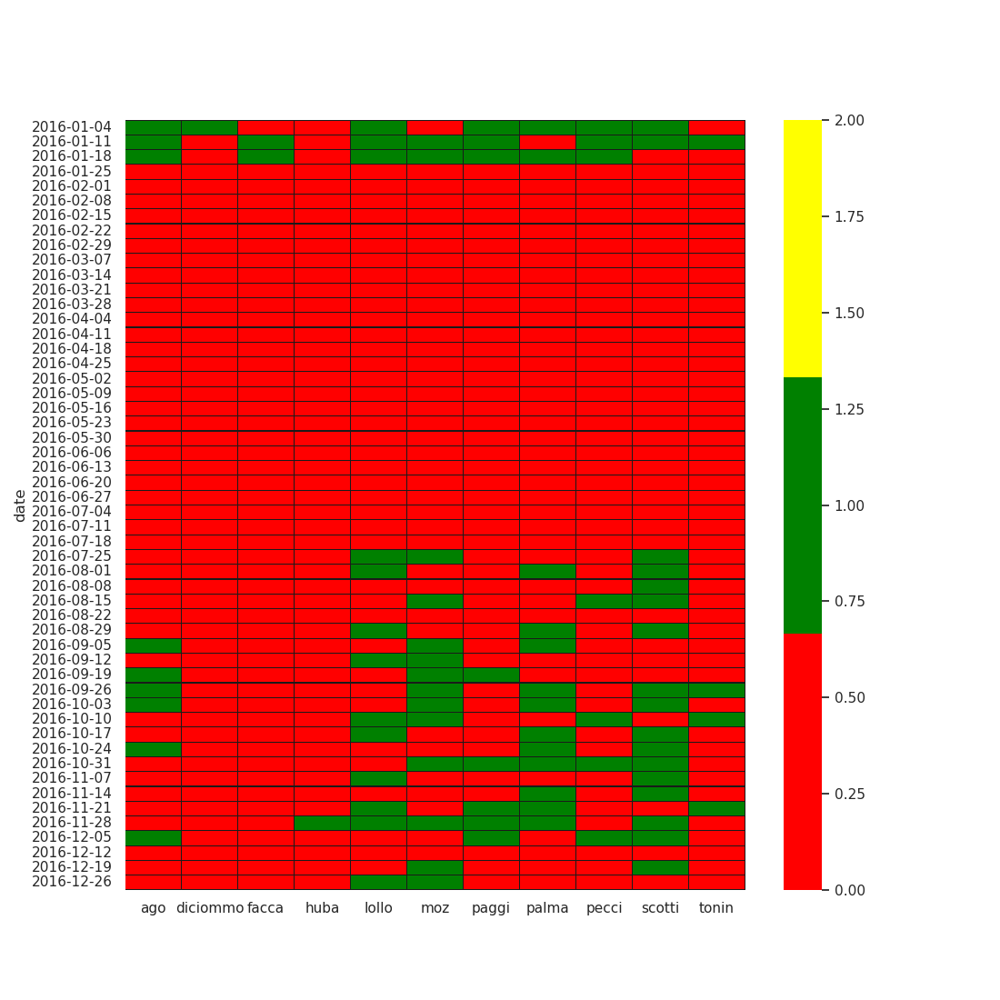
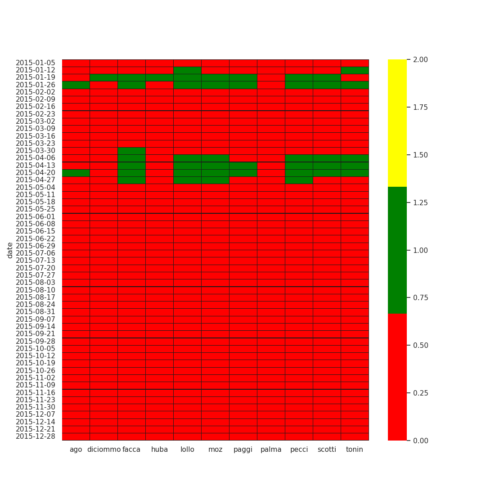
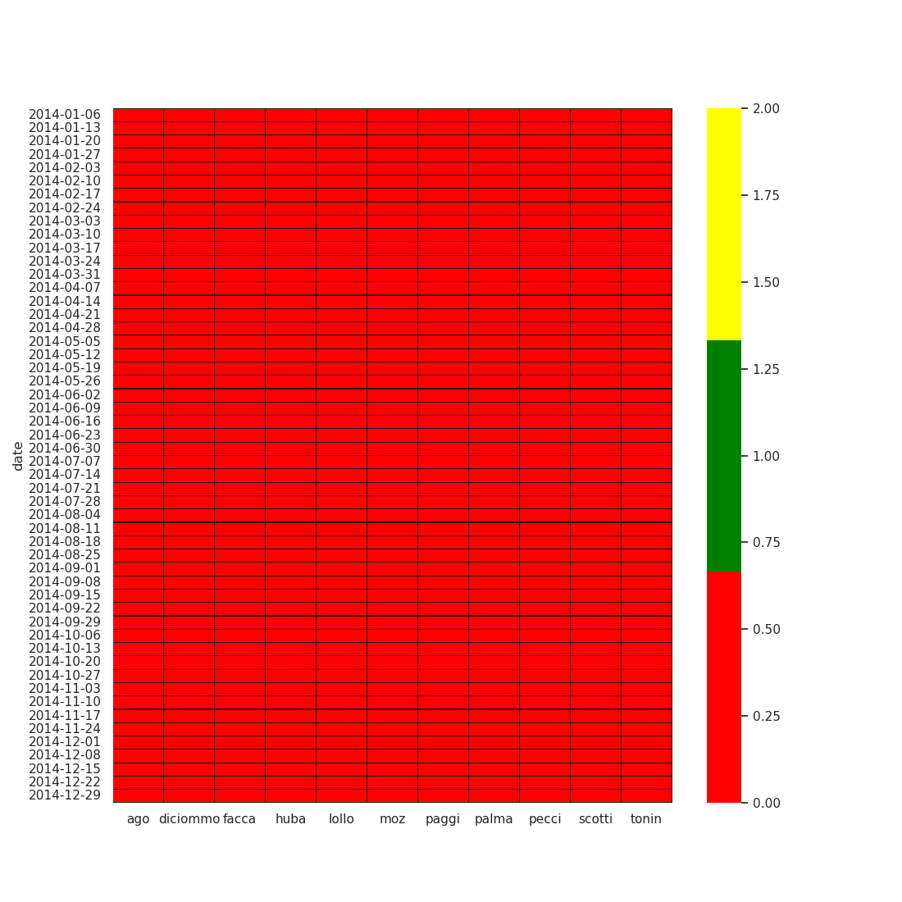
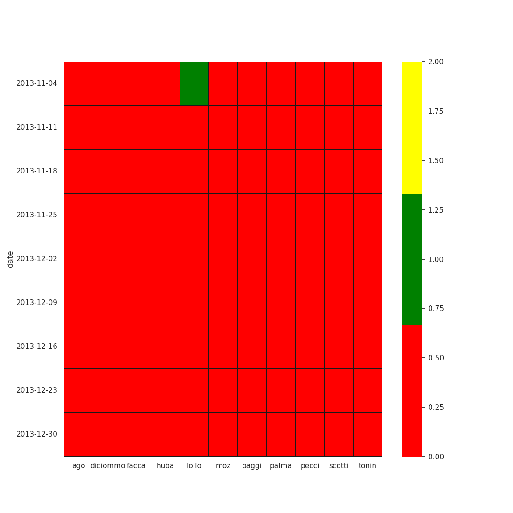

# lothar-face-classification

First use the selfie_selector.py script to select monday selfies from
a list of files. Then check the file generated by selfie_selector.py
with the check_selection.py script.py . Last, use the
check_duplicates.py to remove duplicated selfies listed in the csv
file.

STATUS

